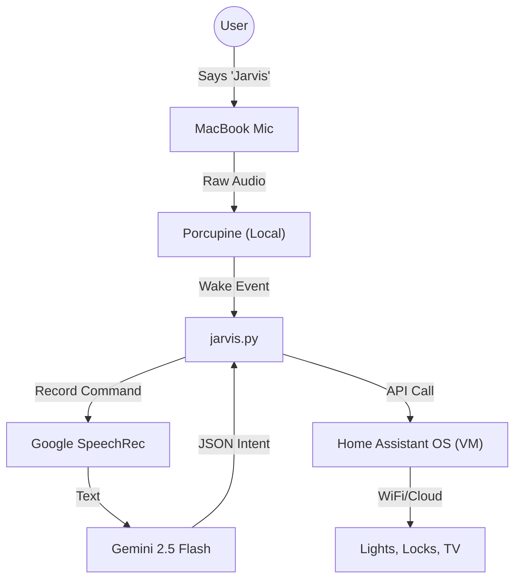

# 🤖 Jarvis (macOS Smart Home Assistant)

A private, locally-hosted voice assistant that turns a MacBook Pro into a dedicated smart home server.

"Jarvis" runs entirely on macOS, orchestrating a headless Home Assistant VM while using local wake-word detection (Porcupine) and cloud-based LLM processing (Gemini 2.5 Flash) to control IoT devices via natural language.

---

## ⚡️ Features
* **Hybrid Voice Architecture:**
    * **Always-Listening (Local):** Uses Picovoice Porcupine to detect "Jarvis" instantly with zero latency and high privacy (no audio sent to cloud).
    * **Command Processing (Cloud):** Offloads complex natural language understanding to Google Gemini 2.5 Flash.
* **Config-Driven Devices:** No coding required to add new devices—simply update the `.env` file, and the AI automatically learns how to control them.
* **Infrastructure as Code:** A single bash script (`start.sh`) manages the VirtualBox VM lifecycle, app launch, and Python execution.
* **Smart Hardware Management:** Optimized for MacBook servers using **AlDente** (battery health) and **Amphetamine** (sleep prevention).
* **Robust Error Handling:**
    * Auto-discovery of microphone hardware indices.
    * Home Assistant API health checks before listening.
    * Graceful shutdown trapping (Ctrl+C safely powers down the VM).

---

## 🛠 Architecture



---

## 📋 Prerequisites

### Hardware
* **MacBook (Intel or M-Series):** Used as the always-on server.
* **Microphone:** Built-in or USB.

### Software Utilities
* **VirtualBox 7.x:** Hypervisor for Home Assistant.
* **Python 3.10+**
* [AlDente](https://apphousekitchen.com/) (Free version) - Limit charge to 75% to prevent battery swelling.
* [Amphetamine](https://apps.apple.com/us/app/amphetamine/id937984704) - Prevent system sleep while lid is closed.

### API Keys
1.  **Picovoice AccessKey:** For wake word detection ([Console](https://console.picovoice.ai/)).
2.  **Google Gemini API Key:** For natural language processing ([AI Studio](https://aistudio.google.com/)).
3.  **Home Assistant Token:** Long-lived access token from your HA profile.

---

## 🖥️ VM Setup (VirtualBox)

This project requires Home Assistant OS running in a VirtualBox VM named **"HAOS"**.

### 1. Download the Image
1.  Go to the [Home Assistant Installation Page](https://www.home-assistant.io/installation/linux).
2.  Scroll to "Virtual Appliances" and download the **VirtualBox (.vdi)** file.
3.  **Unzip** the downloaded file (you will get a `.vdi` file).

### 2. Create the VM
1.  Open VirtualBox and click **New**.
2.  **Name:** `HAOS` (⚠️ Must match `VM_NAME` in your `.env` file).
3.  **Type:** `Linux`.
4.  **Version:** `Other Linux (64-bit)` or `Linux 2.6 / 3.x / 4.x (64-bit)`.
5.  **Hardware:**
    * **RAM:** 2048 MB (Minimum) or 4096 MB (Recommended).
    * **CPUs:** 2.
    * **EFI:** Enable **"Enable EFI (special OSes only)"** if available.
6.  **Hard Disk:**
    * Select **"Use an Existing Virtual Hard Disk File"**.
    * Click the folder icon and select the `.vdi` file you downloaded.

### 3. Critical Network Settings
For the Python script to talk to the VM, they must be on the same network.
1.  Right-click the **HAOS** VM -> **Settings** -> **Network**.
2.  **Adapter 1:**
    * **Attached to:** Select **"Bridged Adapter"**.
    * **Name:** Select your Mac’s active connection (e.g., `en0: Wi-Fi`).
    * *(This assigns the VM its own IP address on your home network).*

---

## 🏠 Home Assistant Setup

Before running Jarvis, you must configure your Home Assistant VM to control your apartment devices.

### 1. Install HACS (Community Store)
HACS is required to download the SmartRent integration.
1.  **Open HA Dashboard:** Go to `http://YOUR_STATIC_IP:8123` (e.g., `http://192.168.1.27:8123`).
2.  **Enable Advanced Mode:** Click **User Profile** (bottom left) -> Toggle **"Advanced Mode"** ON.
3.  **Install Terminal:** Go to **Settings** > **Add-ons** > **Add-on Store** > Search for **"Terminal & SSH"**. Install and Start it.
4.  **Run Installer:** Open the "Terminal" web UI and run this command:
    ```bash
    wget -O - [https://get.hacs.xyz](https://get.hacs.xyz) | bash -
    ```
5.  **Restart:** Go to **Developer Tools** > **Restart**.
6.  **Activate:** After reboot, go to **Settings** > **Devices & Services** > **Add Integration** > Search **"HACS"** and initialize it (requires GitHub login).

### 2. Install SmartRent Integration
This connects your apartment's physical lock and lights to Home Assistant.
1.  **Open HACS:** Click **HACS** in the sidebar.
2.  **Search:** Type **"SmartRent"** in the search bar.
3.  **Download:** Click **Download** and wait for it to finish.
4.  **Restart:** Go to **Developer Tools** > **Restart** (Required!).
5.  **Configure:**
    * Go to **Settings** > **Devices & Services** > **Add Integration**.
    * Search **"SmartRent"**.
    * **Login:** Enter your SmartRent email and password.
    * **Verify:** You should now see entities like `lock.front_door_lock` and `switch.entry_light`.

### 3. Disable IPv6 (Fixes Timeouts)
To prevent WebSocket timeouts with the SmartRent cloud:
1.  Go to **Settings** > **System** > **Network**.
2.  Uncheck / Disable **IPv6**.
3.  Restart Home Assistant one last time.

---

## 🚀 Installation

### 1. Clone & Prepare
```bash
git clone [https://github.com/yourusername/jarvis-mac.git](https://github.com/yourusername/jarvis-mac.git)
cd jarvis-mac
```

### 2. Install Python Dependencies
```bash
pip3 install -r requirements.txt
```

### 3. Configuration (.env)
Create a file named `.env` in the root directory.

**⚠️ Important:** This project is Config-Driven. To add new devices, simply update the `DEVICES_JSON` map below.

```ini
# --- SECRETS ---
PICOVOICE_ACCESS_KEY="your_picovoice_key_here"
GOOGLE_API_KEY="your_gemini_key_here"
HA_TOKEN="your_long_lived_ha_token"
HA_URL="[http://192.168.1.](http://192.168.1.)XX:8123"  # Use your Static IP

# --- HARDWARE ---
MIC_NAME="MacBook Pro Microphone"

# --- SYSTEM ---
VM_NAME="HAOS"
SCRIPT_NAME="jarvis.py"

# --- DEVICES MAP (Dynamic) ---
# Syntax: "Friendly Name": "ha_entity_id"
DEVICES_JSON='{
  "entry_light": "switch.entry_light",
  "kitchen_light": "switch.kitchen_light",
  "front_door": "lock.front_door_lock",
  "tv": "media_player.terminal_vision",
  "living_room_fan": "switch.my_fan"
}'
```

---

## 🖥️ Usage

**One-Click Start:**
Run the orchestration script. This handles booting the VM (if off), launching the VirtualBox app, and starting the voice engine.

```bash
./start.sh
```

**Commands:**
* *"Jarvis, turn on the kitchen lights."*
* *"Jarvis, secure the apartment."* (Gemini infers: Locks door)
* *"Jarvis, open YouTube on the TV."* (Gemini infers: Changes TV source)
* *"Jarvis, stop."* (Shuts down voice engine)

**Stopping:**
Press `Ctrl+C` in the terminal.
* The script will ask: `🤔 Do you want to shutdown Home Assistant (HAOS)? [y/N]`
* **y:** Safely shuts down the VM and quits VirtualBox.
* **N:** Keeps the server running in the background.

---

## 🐛 Troubleshooting

| Error | Fix |
| :--- | :--- |
| `PaMacCore (AUHAL)` / Mic Error | Your terminal lacks permission. Run `tccutil reset Microphone` and restart terminal. |
| `Timed out during opening handshake` | Disable **IPv6** in Home Assistant Network settings. |
| `VM failed to start` | Run `VBoxManage discardstate "HAOS"` to clear "Saved/Aborted" states. |
| Script hangs at `(Listening...)` | Ensure `adjust_for_ambient_noise` is disabled in code (fixed in v1.0). |

---

## 📜 License
MIT License. Feel free to fork and modify for your own smart home setup.
